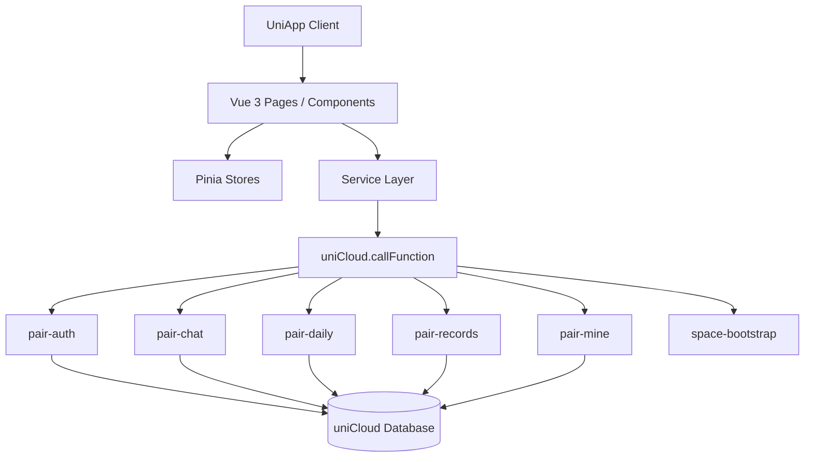
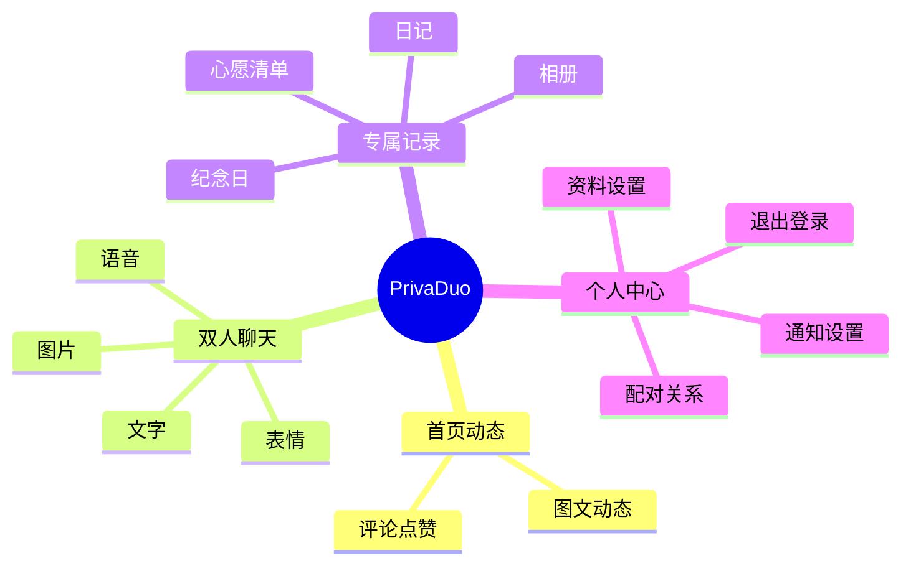

# PrivaDuo

<p align="center">
  
</p>

<p align="center">
  一个基于 <code>UniApp + Vue 3 + Pinia + uniCloud</code> 构建的双人私密空间应用示例项目。
</p>

<p align="center">
  聚焦情侣/伴侣双人场景，强调双向绑定、私密互动、双端同步与安全开源部署。
</p>

---

<a id="toc"></a>
## 目录

- [项目简介](#overview)
- [核心功能](#features)
- [技术架构](#architecture)
- [项目结构](#structure)
- [环境依赖](#requirements)
- [快速开始](#quick-start)
- [安装与部署](#deployment)
- [使用指南](#usage)
- [API 文档说明](#api-docs)
- [测试与质量保障](#testing)
- [安全开源说明](#security)
- [FAQ](#faq)
- [贡献指南](#contributing)
- [许可证](#license)
- [联系方式](#contact)

<a id="overview"></a>
## 项目简介

`PrivaDuo` 是一个专注于双人亲密关系场景的移动端私密应用示例项目，围绕「仅支持两人、强绑定、无公开社交入口」这一核心原则进行设计和实现。

与普通社交产品不同，本项目在产品规则层面做了严格约束：

- 整个应用仅支持 `2` 个账号一对一强绑定
- 不允许添加第三人、好友列表、群聊或公开内容广场
- 邀请码在绑定成功后永久失效
- 解绑必须采用双方双向确认机制
- 解绑后历史数据仍需在本地和云端保留
- 未绑定状态下，核心互动功能保持受限或禁用

该仓库已处理为适合公开托管的开源版本，默认不会连接任何私人 uniCloud 空间。

<a id="features"></a>
## 核心功能

### 账号与绑定

- 手机号验证码登录/注册
- 昵称、头像等基础资料完善
- 6 位邀请码生成、校验与双人绑定
- 仅支持一对一绑定，不支持第三方加入

### 四大 Tab 模块

- 首页动态：双人专属内容流、图文互动
- 双人聊天：文字、图片、表情、语音等消息形态
- 专属记录：日记、纪念日、心愿清单等共同记录
- 我的中心：资料修改、通知设置、关系管理、退出登录

### 双人私密能力

- 聊天记录本地与云端双向同步
- 双方可见的动态、评论、点赞
- 双人共写日记与纪念日倒计时
- 共同心愿清单与共享相册能力

### 安全与约束

- 敏感请求通过签名校验与安全元数据传递
- 云函数密钥通过环境变量管理
- 前端本地缓存加密支持设备侧随机密钥
- 开源仓库默认不包含真实空间配置、私钥和证书

<a id="architecture"></a>
## 技术架构

### 技术栈

| 层级 | 技术方案 |
| --- | --- |
| 客户端框架 | UniApp |
| 前端语言/范式 | Vue 3 组合式 API |
| 状态管理 | Pinia |
| 云开发 | uniCloud |
| 服务端形态 | 云函数 + 云数据库 |
| 测试工具 | Jest + Playwright |
| 构建工具 | Vite |

### 架构示意



### 页面信息架构



<a id="structure"></a>
## 项目结构

```text
PrivaDuo-app/
├── src/
│   ├── components/              # 通用业务组件
│   ├── pages/                   # 页面模块
│   ├── services/                # 前端服务层
│   ├── stores/                  # Pinia 状态管理
│   ├── utils/                   # 工具函数与安全封装
│   └── static/                  # 静态资源
├── tests/
│   ├── e2e/                     # Playwright 端到端测试
│   └── unit/                    # Jest 单元测试
├── uniCloud-aliyun/
│   ├── cloudfunctions/          # 云函数
│   └── database/                # uniCloud 数据库 schema/index
├── docs/                        # 部署与安全相关文档
└── README.md
```

<a id="requirements"></a>
## 环境依赖

建议使用以下开发环境：

- Node.js `18+`
- npm `9+`
- HBuilderX 最新稳定版
- DCloud 账号与 uniCloud 阿里云空间
- Git `2.20+`

推荐安装/准备：

- 微信开发者工具或 HBuilderX 运行环境
- Playwright 浏览器依赖
- 一套你自己的测试手机号和 uniCloud 空间

<a id="quick-start"></a>
## 快速开始

### 1. 克隆项目

```bash
git clone https://github.com/yang-code-dev/PrivaDuo-app.git
cd PrivaDuo-app
```

### 2. 安装依赖

```bash
npm install
```

### 3. 复制私有配置模板

```bash
cp src/utils/cloud.template.js src/utils/cloud.js
```

### 4. 填写你自己的 uniCloud 私有配置

请在 `src/utils/cloud.js` 中按需填写：

- `spaceId`
- `clientSecret`
- `endpoint`
- `hostingOrigin`
- `publicSignSecret`
- `localCryptoSecret`

说明：

- `src/utils/cloud.js` 属于本地私有文件，已被 `.gitignore` 屏蔽
- 不要将真实配置提交到公开仓库
- `localCryptoSecret` 可留空，系统会自动生成按设备隔离的本地随机密钥

### 5. 启动本地 H5 开发

```bash
npm run dev:h5
```

<a id="deployment"></a>
## 安装与部署

### 一、初始化 uniCloud 空间

1. 使用你自己的 DCloud 账号在 HBuilderX 中创建或绑定 uniCloud 阿里云空间
2. 导入 `uniCloud-aliyun/database/` 中的所有 schema 和 index
3. 部署 `uniCloud-aliyun/cloudfunctions/` 下的云函数到你自己的空间

### 二、配置云函数环境变量

必填环境变量：

```bash
PAIRSPACE_PUBLIC_SIGN_SECRET=your_public_sign_secret
PAIRSPACE_CRYPTO_SECRET=your_crypto_secret
```

测试环境可选变量：

```bash
PAIRSPACE_SMS_TEST_MODE=true
PAIRSPACE_FIXED_SMS_CODE=123456
```

建议：

- 为不同环境使用不同密钥
- 使用密码管理器或安全随机生成器生成密钥
- 不要将这些值写回源码或截图中

### 三、运行与构建

本地开发：

```bash
npm run dev:h5
```

单元测试：

```bash
npm run test:unit
```

端到端测试：

```bash
PLAYWRIGHT_BASE_URL=http://localhost:5173 npm run test:e2e
```

如果你需要运行依赖托管地址的 E2E 用例，可同时设置：

```bash
PLAYWRIGHT_BASE_URL=http://localhost:5173 \
PAIRSPACE_HOSTING_ORIGIN=http://localhost:5173 \
npm run test:e2e
```

### 四、H5 发布说明

当前仓库中的 `publish:h5:*` 脚本已改为通用安全版本，不再包含本机绝对路径和真实空间参数。使用前请通过环境变量提供你自己的本地 HBuilderX CLI 路径与 uniCloud 空间配置。

仅构建 H5：

```bash
HBUILDERX_CLI=/Applications/HBuilderX.app/Contents/MacOS/cli npm run publish:h5:web
```

构建并上传到你自己的 uniCloud 空间：

```bash
HBUILDERX_CLI=/Applications/HBuilderX.app/Contents/MacOS/cli \
PAIRSPACE_UNICLOUD_SPACE_ID=your-space-id \
npm run publish:h5:hosting
```

可选环境变量：

- `PAIRSPACE_WEB_TITLE`：自定义网页标题，默认值为 `PrivaDuo`
- `PAIRSPACE_UNICLOUD_PROVIDER`：云服务商，默认值为 `aliyun`

更详细的发布说明请参考：

- `docs/h5-web-hosting-deploy.md`
- `docs/h5-runtime-troubleshooting.md`

<a id="usage"></a>
## 使用指南

### 典型使用流程

1. 首次启动后完成手机号登录
2. 完善昵称与头像等个人资料
3. 进入配对关系页面生成或输入邀请码
4. 完成双人绑定后解锁完整功能
5. 进入四大 Tab 使用聊天、动态、记录、个人中心能力

### 绑定规则说明

- 一个账号只允许与一个对象建立强绑定关系
- 不支持第三人加入，不支持群聊或好友列表
- 邀请码在绑定成功后永久失效
- 未绑定状态下，互动能力会受到限制

### 四大 Tab 说明

| Tab | 说明 |
| --- | --- |
| 首页动态 | 发布双人可见的图文动态，支持评论与点赞 |
| 双人聊天 | 展示会话消息流，支持多种消息类型与状态同步 |
| 专属记录 | 管理共同日记、纪念日、心愿清单等关系资产 |
| 个人中心 | 查看资料、通知设置、相册、关系状态和退出登录 |

<a id="api-docs"></a>
## API 文档说明

本项目未提供独立 Swagger/OpenAPI 文档，前后端通信基于 uniCloud 云函数完成。建议从“前端服务层 -> 云函数 -> 数据库表”的映射关系理解接口边界。

### 前端服务层

| 服务文件 | 主要职责 |
| --- | --- |
| `src/services/auth.js` | 登录、注册、资料完善、绑定关系初始化 |
| `src/services/chat.js` | 聊天会话、发送消息、消息同步 |
| `src/services/daily.js` | 首页动态、纪念日、互动数据 |
| `src/services/records.js` | 日记、纪念日、心愿清单等记录数据 |
| `src/services/mine.js` | 我的中心、通知设置、关系管理 |

### 云函数说明

| 云函数 | 说明 |
| --- | --- |
| `pair-auth` | 账号、会话、邀请码、绑定流程 |
| `pair-chat` | 聊天消息读写与同步 |
| `pair-daily` | 动态流、互动行为、首页数据 |
| `pair-records` | 日记、纪念日、心愿清单等记录模块 |
| `pair-mine` | 个人资料、通知设置、关系状态、解绑流程 |
| `space-bootstrap` | H5 云连通性检测与调试引导 |

### 核心数据表

| 数据表 | 说明 |
| --- | --- |
| `users` | 用户信息 |
| `couple_bind` | 双人绑定关系 |
| `messages` | 聊天消息 |
| `moments` | 动态内容 |
| `diaries` | 共同日记 |
| `anniversaries` | 纪念日 |
| `wishlists` | 心愿清单 |
| `albums` | 相册资源 |

### 接口阅读建议

建议按以下顺序阅读代码：

1. `src/services/*`
2. `src/stores/*`
3. `uniCloud-aliyun/cloudfunctions/*`
4. `uniCloud-aliyun/database/*`

<a id="testing"></a>
## 测试与质量保障

项目内已包含基础自动化测试能力：

- `npm run test:unit`：运行 Jest 单元测试
- `npm run test:e2e`：运行 Playwright 端到端测试

建议在提交前完成以下检查：

- 本地页面能正常启动
- `src/utils/cloud.js` 未被纳入版本控制
- 核心云函数环境变量已正确配置
- 绑定、聊天、动态、记录、通知设置等主链路可正常使用

<a id="security"></a>
## 安全开源说明

### 已完成的开源安全处理

- 当前仓库不再包含真实 `spaceId`、`clientSecret`、托管域名或云端密钥
- `src/utils/cloud.js` 作为本地私有配置文件，不参与公开版本控制
- 云函数密钥通过环境变量管理，不在源码中硬编码
- 前端本地缓存加密支持随机本地密钥，不依赖固定 AES IV

### 开源使用者须知

- 此仓库不会自动访问原作者的云端资源
- 你必须创建自己的 uniCloud 空间并部署数据库与云函数
- 你必须填写自己的 `src/utils/cloud.js`
- 你必须自行维护自己的短信、托管域名和环境变量

### 发布前检查清单

- 确认 `.gitignore` 已屏蔽私有配置、证书、缓存和调试产物
- 确认提交中不包含真实 `spaceId`、`clientSecret`、托管域名和密钥
- 确认 Issue、文档、截图和测试日志未暴露私有信息

<a id="faq"></a>
## FAQ

### 1. 为什么项目只支持两个人，不支持第三人加入？

这是产品的核心约束。项目从数据结构、交互逻辑到云函数权限模型都基于“双人强绑定”设计，不提供好友列表、群聊或公开社交入口。

### 2. 为什么仓库里没有真实的 `cloud.js`？

因为 `src/utils/cloud.js` 属于私有配置文件，包含你的 uniCloud 空间接入信息。公开仓库只保留 `src/utils/cloud.template.js` 模板，避免泄露个人云资源。

### 3. 为什么我配置好前端后仍然无法访问云函数？

通常需要同时排查以下内容：

- `src/utils/cloud.js` 是否填写了正确的 `spaceId` 和 `clientSecret`
- uniCloud 空间是否已部署对应云函数
- 环境变量是否已配置完成
- H5 域名白名单是否允许当前调试地址

### 4. `publish:h5:*` 脚本能直接用吗？

不建议直接照搬。发布脚本通常与本机 HBuilderX 路径、项目绝对路径和云空间配置强相关，正式使用前请替换成你自己的参数，或通过 HBuilderX 图形界面发布。

### 5. 本项目默认采用什么授权协议？

当前仓库尚未附带独立的 `LICENSE` 文件。如需公开协作、二次分发或商用，请先补充明确的开源许可证并同步更新本节内容。

<a id="contributing"></a>
## 贡献指南

欢迎通过 Issue 或 Pull Request 参与改进。

### 推荐贡献流程

1. Fork 仓库并创建功能分支
2. 保持双人私密产品约束不被破坏
3. 提交前完成必要测试与自检
4. 在 PR 中清晰说明修改动机、影响范围和验证方式

### 贡献约束

- 不要引入第三人社交逻辑、群聊、公开推荐流等与项目定位冲突的功能
- 不要提交真实 `cloud.js`、证书、环境变量或私有云空间信息
- 涉及权限、安全、绑定流程的改动，请附带充分说明

<a id="license"></a>
## 许可证

当前仓库暂未附带正式的开源许可证文件。

如你希望该项目支持更明确的开源协作，建议补充以下其中之一：

- `MIT`
- `Apache-2.0`
- `GPL-3.0`

补充许可证后，请同步更新本节说明。

<a id="contact"></a>
## 联系方式

出于隐私与开源安全考虑，本仓库不在文档中公开个人手机号、邮箱或私有联系方式。

如需反馈问题或参与讨论，建议使用：

- GitHub Issues
- GitHub Pull Requests
- 仓库主页讨论区或后续补充的 Discussions

---

如果这个项目对你有帮助，欢迎 `Star` 仓库，并在你自己的 uniCloud 空间中完成部署与二次开发。
